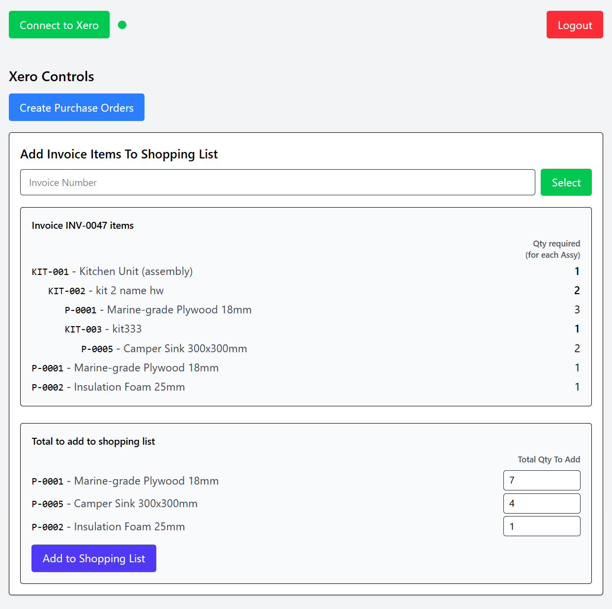

# Xero Invoice Orderer Overview:

This is a web application that connects to Xero accounts software via the Xero API. It retrieves assemblies defined in customer invoices, and creates a single purchase order for each supplier for the parts required to fulfill those assemblies.

It uses a `Supabase` Database built on `PostgreSQL` to store user and application data, `Go` for the backend API, a lightweight frontend built using `HTMX`, `TailwindCSS` and `DaisyUI`, with `Docker` for containerization.



# Setup:

## Download Make. (Makefile)

## Development:

### 1. Watch CSS changes (from root):
```
make watch-css
```

### 2. Install (on restart) And Run AIR :
```
export PATH=$HOME/go/bin:/usr/local/go/bin:$PATH
export PATH="$HOME/go/bin:$PATH"
source ~/.bashrc
cd src/
air
```


## Build for production:

```
make build-css
docker build -f Dockerfile -t flashcards-app .
```


## Run tests:

Unit tests:
```
go test ./...
```

Integration tests (requires Docker running):
```
go test -tags=integration ./...
```

Reset Go test cache:
```
go clean -testcache
```